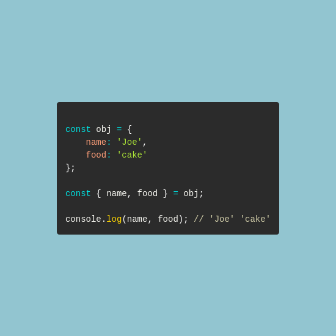

# Code Snippets
Generating and storing code snippets for various tips and tricks



## Generate Snippet w/ GitHub Actions

### Admin Workflow Approval
Approve these actions after triggering


### Run the `Upload Draft Snippet` Action
Makes folder in the `/drafts` with metadata inputs


### `Delete Draft Snippet` Action
Removes snippet from `/drafts` folder if found


### Run the `Draft Generator Test` Action
Acceses the `/drafts` folder and attempts to generate a snippet


### Run the `Generate Snippet` Action
Acceses the `/drafts` folder, generates the snippet image, save to `/snippets` folder


### `Delete Published Snippet` Action
Removes snippet from `/snippets` folder if found


## Supported Languages:
See [`languages.json`](./generator/src/constants/languages.json)

## Run Snippet Generator Locally
Run the following commands to make snippet draft, and generate a snippet image:
```sh
  git clone https://github.com/spencerlepine/code-snippets.git
  cd code-snippets
  mkdir -p ./drafts/my-cool-snippet
  cp -a ./drafts/example-snippet/. ./drafts/my-cool-snippet
  # edit "snippet.js" and "metadata.json"
  mkdir -p ./generator/src/tmp
  cp -a ./drafts/my-cool-snippet/. ./generator/src/tmp
  cd generator && npm install
  npm run generate:screenshot
  cd ..
  mkdir -p ./snippets/my-cool-snippet
  cp -a ./generator/src/tmp/. ./snippets/my-cool-snippet
  # view the ".png" file in ./snippets/my-cool-snippet
```

### Takes metadata
```json
{
  "name": "JavaScript Destructuring",
  "description": "Discover JavaScript object destructuring. A common way to cleanly extract properties from objects.",
  "hashtags": [
    "#javascript",
    "#coding",
    "#programming",
  ],
  "language": "javascript",
  "header": {
    "supertitle": "",
    "title": "JavaScript Destructuring"
  },
}
```

### Generates snippet image


### Saves output metadata
```diff
{
  "name": "JavaScript Destructuring",
  "description": "Discover JavaScript object destructuring. A common way to cleanly extract properties from objects.",
  "hashtags": [
    "#javascript",
    "#coding",
    "#programming",
  ],
  "language": "javascript",
+  "slug": "javascript-destructuring",
  "header": {
    "supertitle": "",
    "title": "JavaScript Destructuring"
  },
+  "image_file": "snippet.png",
+  "date": "2022-04-15T21:39:32.284Z"
}
```

### Saves POST text file (for social media)
```
// post.txt
Discover JavaScript object destructuring. A common way to cleanly extract properties from objects.

#javascript #softwareengineer #coding #programming #developer #software #code
```

